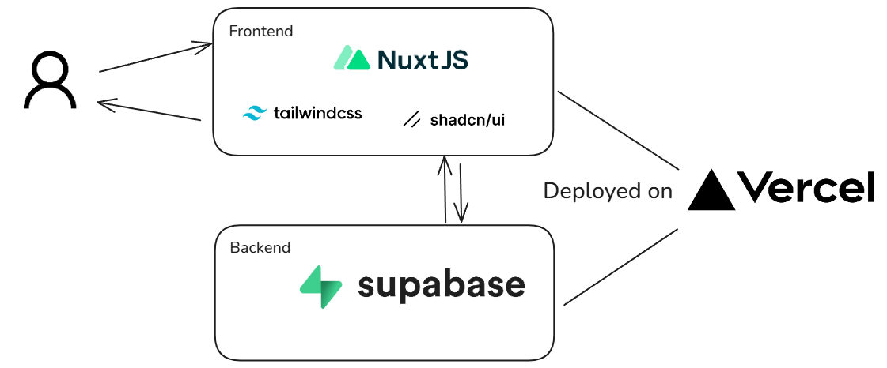

# Circa Frontend (Nuxt 4 + Supabase)

This is the Circa web app built with Nuxt 4, Vue 3, Pinia, Tailwind, and shadcn-vue. It uses Supabase for auth, database, storage, and realtime features.

## Tech Stack



## Quickstart

1. Install dependencies

```bash
npm install
```

2. Configure Supabase environment

Create a `.env` (or `.env.local`) file in the project root with your Supabase project keys:

```bash
SUPABASE_URL=your-project-url
SUPABASE_ANON_KEY=your-anon-key
```

Where to find these:

- In Supabase Dashboard: Project Settings → API → Project URL and anon public API key.

Notes:

- These map to `runtimeConfig.public` in `nuxt.config.ts` and are used by the Supabase plugin.
- If you don’t set them, the app will still start but Supabase calls will return an error like "Supabase env not set".

3. Start the dev server

```bash
npm run dev
```

Open `http://localhost:3000`.

## Build & Preview

```bash
npm run build
npm run preview
```

## Docker (optional)

There is a `Dockerfile` and `compose.yaml`. Provide the same env vars (`SUPABASE_URL`, `SUPABASE_ANON_KEY`) to your environment or an `.env` file so the container picks them up.

## How the codebase works (circa/)

- `nuxt.config.ts`: Enables Tailwind, shadcn-nuxt, Google Fonts, Pinia; wires `runtimeConfig.public.supabaseUrl` and `runtimeConfig.public.supabaseAnonKey` from `SUPABASE_URL` and `SUPABASE_ANON_KEY`.
- `app/plugins/supabase.ts`: Creates a single `$supabase` client (injected via Nuxt app). If env vars are missing, provides a safe placeholder that returns a clear error.
- `app/stores/session.store.ts`: Pinia store that manages auth session, user, and sign-in/sign-up/logout flows using `$supabase.auth`. Subscribes to auth state changes on the client.
- `app/middleware/auth.global.ts`: Guards routes that set `to.meta.requiresAuth`; redirects to `/login` if not authenticated. Runs client-side to avoid SSR false-negatives.
- `app/composables/`: Reusable logic:
  - `useChat.ts`, `useConversationsList.ts` handle realtime channels, queries, and RPCs against Supabase.
- `app/services/`: Thin data layer around `$supabase` for items, profiles, categories, conversations, and uploads.
- `app/pages/`: Nuxt routes (marketplace browse, items, chat, profiles, auth callback, etc.).
- `app/components/`: UI building blocks; `components/ui/**` contains shadcn-vue components auto-generated via `shadcn-nuxt`.
- `app/layouts/`: App-wide shells such as the default and marketplace layouts.
- `app/assets/css/main.css`: Tailwind entrypoint.

### Auth flow

1. The app bootstraps `$supabase` from the plugin using your env values.
2. `session.store` loads the current session and subscribes to auth changes.
3. Routes with `meta.requiresAuth` are checked by `auth.global.ts` and redirect to `/login` when needed.

### Environment summary

- Required for Supabase: `SUPABASE_URL`, `SUPABASE_ANON_KEY` (in `.env`/`.env.local`).
- These are referenced by `nuxt.config.ts` and used everywhere via the injected `$supabase` client.

If you run into auth/storage/db errors, verify your env is set and the keys are valid for the current Supabase project.
